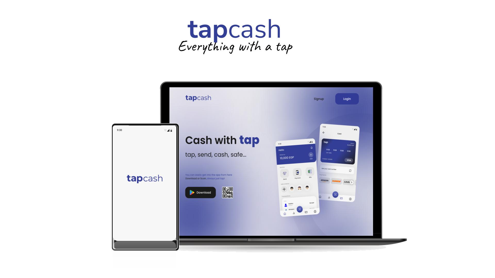
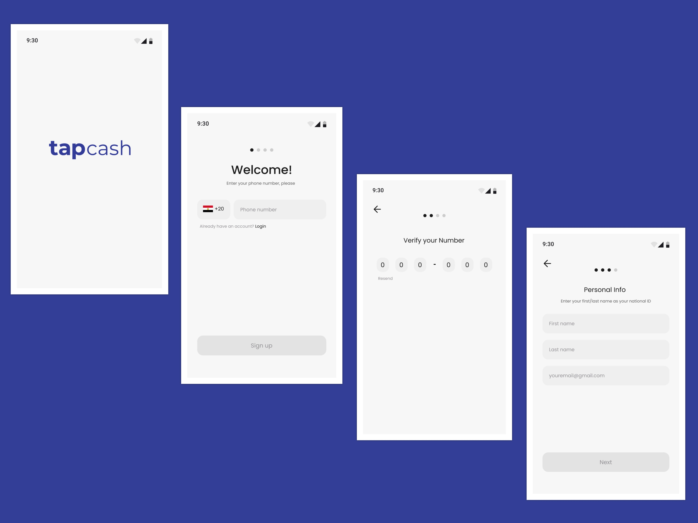
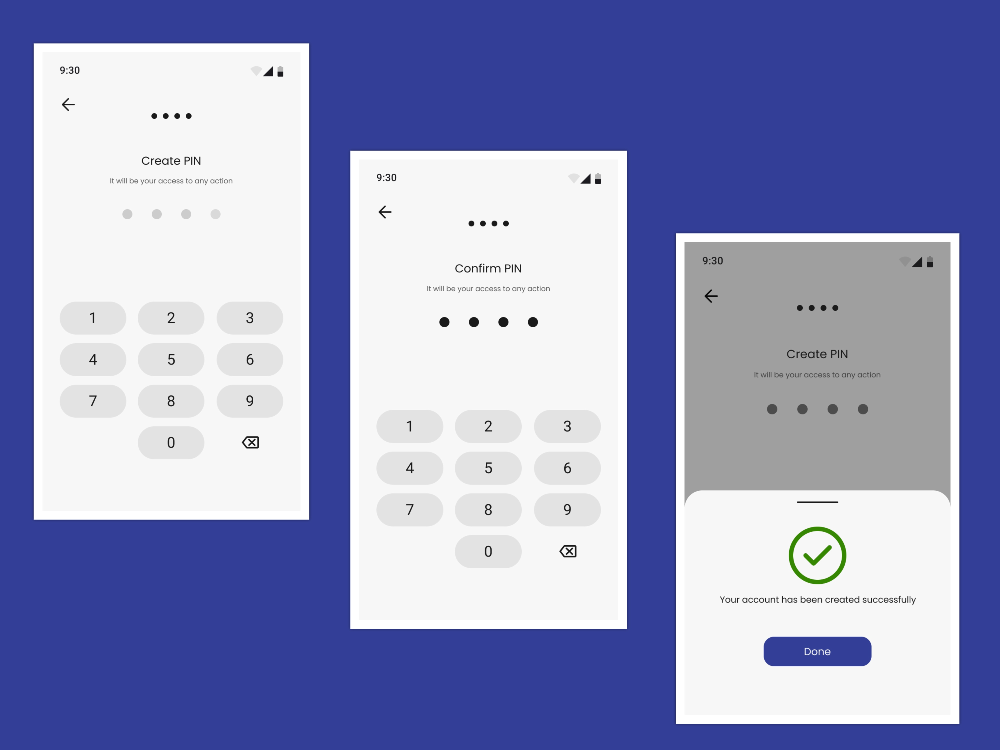
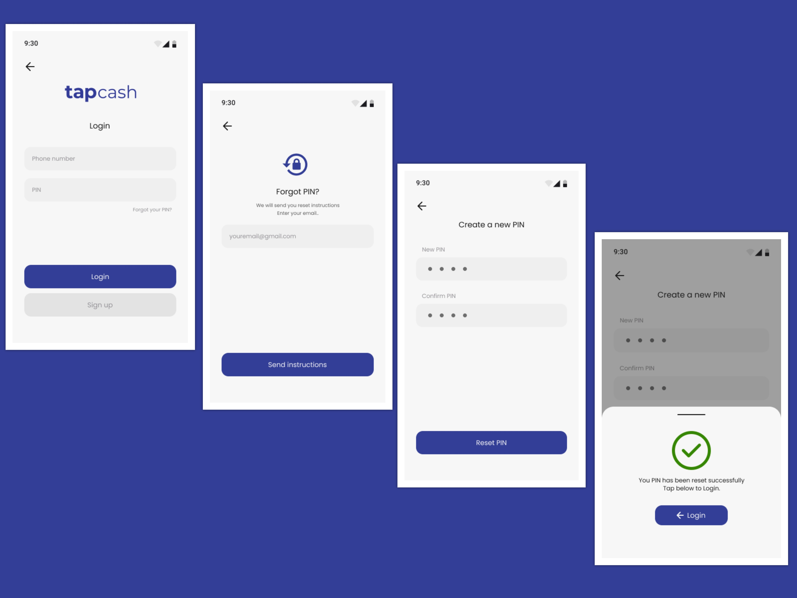
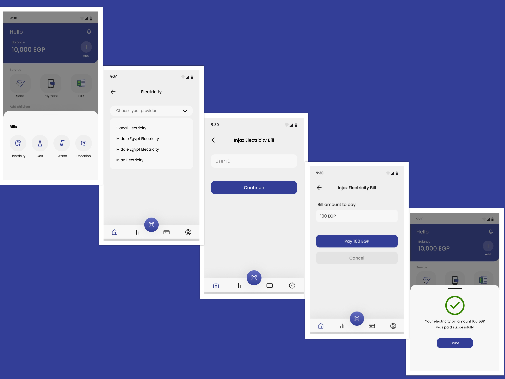
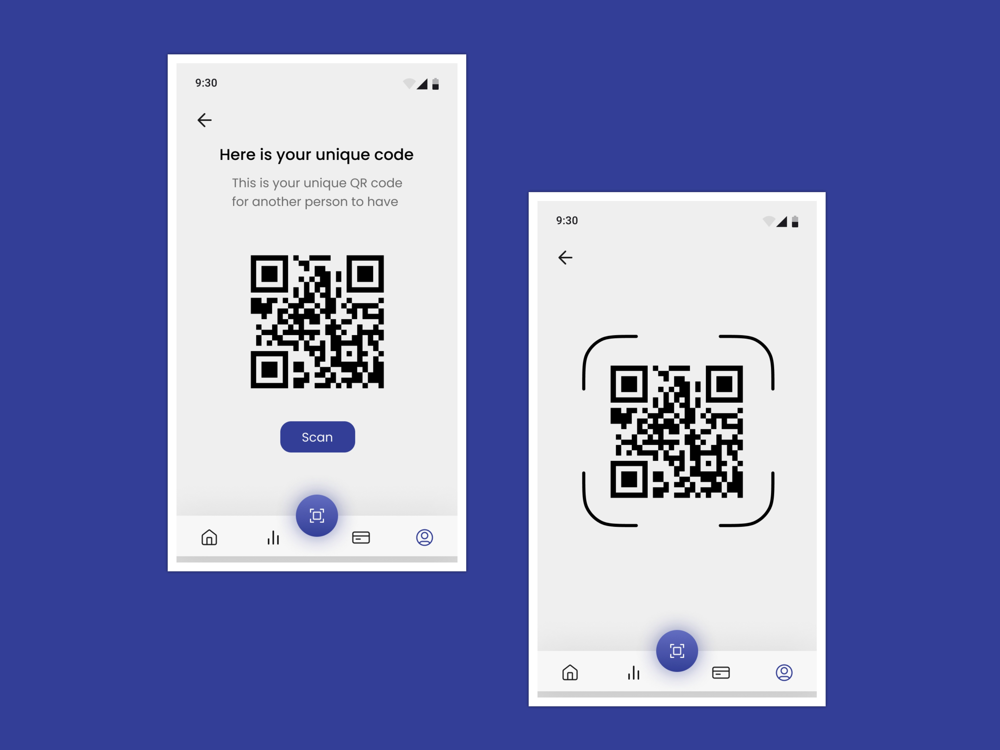
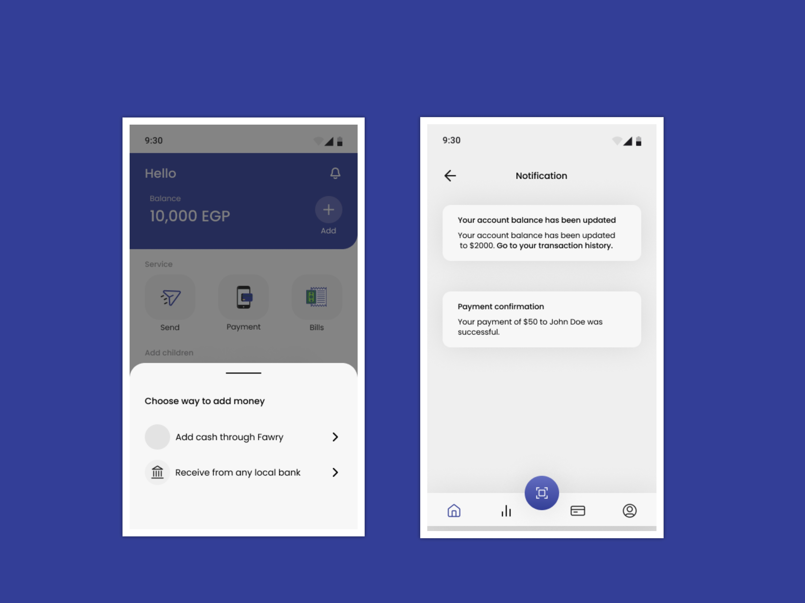

    <h1 align='center'>⚡️<i>Orange Hackathon</i>⚡️</h1>
   

<h2 style="display:inline">📝 Table of Contents</h2>

 
- [📷 Features](#features)
- [⛏️ Built With](#built-with)
- [🏁 Getting started](#getting-started)
- [🏁 API Documentation](#API-Documentation)
- [✍️ Contributors](#contributors)
- [🔒 License](#license)

<h2 href="#BuiltWith">Built With : </h2>
 <ul>
  <li><a href="https://flutter.dev/">Flutter</a></li>
  <li><a href="https://dart.dev/">Dart</a></li>
 </ul>

<h2 href="#GettingStarted">Getting Started</h2>
<blockquote>
  
This is a list of needed steps to set up your project locally, to get a local copy up and running follow these instructions.
 

</blockquote>
<ol>
  <li><strong><em>Clone the repository</em></strong>
    

        <code>$ git clone https://github.com/Orange-Hackathon/Cross-Platform.git</code>
    

  </li>
  <li><strong><em>Install dependencies</em></strong>
    

        <code>$ flutter pub get</code>
    

  </li>
  <li><strong><em>Start the application</em></strong>
    

        <code>$ flutter run</code>
    

  </li>

</ol>

## 📷 Features

<h4 style="display:inline">
<strong><em>🔒 User Authentication</em></strong></h4>

 
   
    
    

<h4 style="display:inline">
<strong><em>🔒 Home</em></strong></h4>

 
   

<h4 style="display:inline">
<strong><em>🔒 Children </em></strong></h4>

 
   

<h4 style="display:inline">
<strong><em>🔒 Send money to your friends </em></strong></h4>

 
   

<h4 style="display:inline">
<strong><em>🔒 Pay your bills </em></strong></h4>

 
   

<h4 style="display:inline">
<strong><em>🔒 Scan QR code </em></strong></h4>

 
   

<h4 style="display:inline">
<strong><em>🔒 Notifications & Ways to send money </em></strong></h4>

 
   

<h2 href="#Contributors">Contributors</h2>

<table>
  <tr>

<td align="center">
<a href="https://github.com/AhmedLotfy02" target="_black">
 <b>Ahmed Lotfy</b></a> 
</td>

</tr>

</table>

## 🔒 License 

> This software is licensed under MIT License, See [License](https://github.com/CMP24-SWE-TEAM3/Backend/blob/main/LICENSE) .

